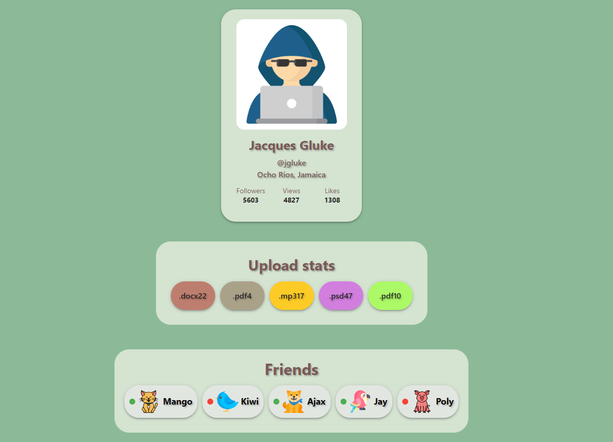

# Profile-components

It's a set of typed components for a user profile with props.

## Tech Stack

Frontend: TypeScript, React components.

### Local launch of the program on your device

1. Download repository and install dependencies -> npm install
2. Launch the application -> npm start.

